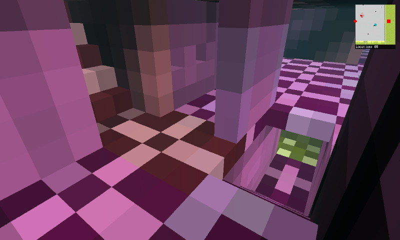
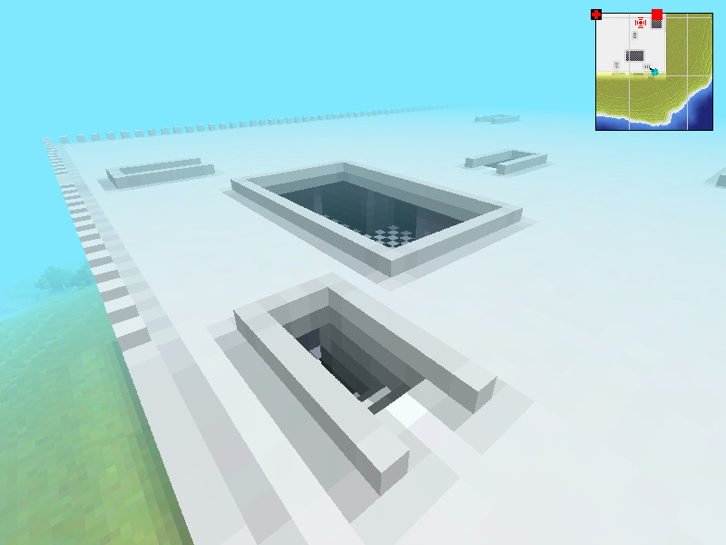
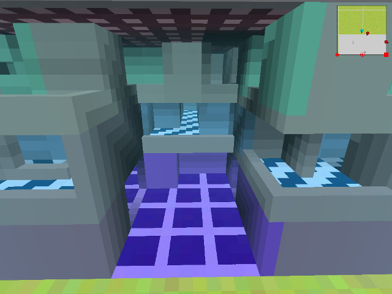
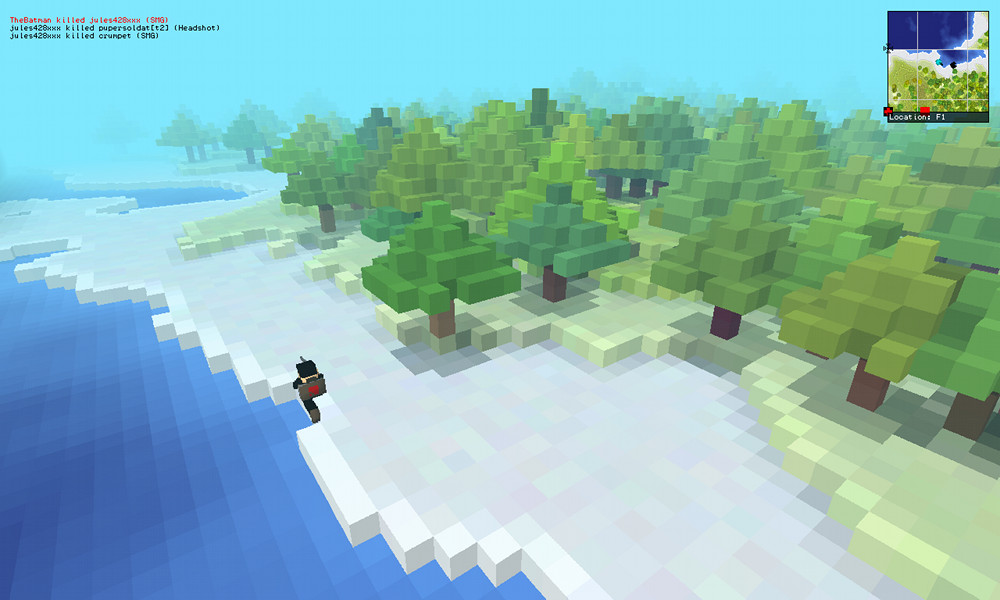
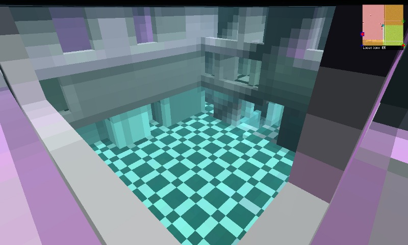
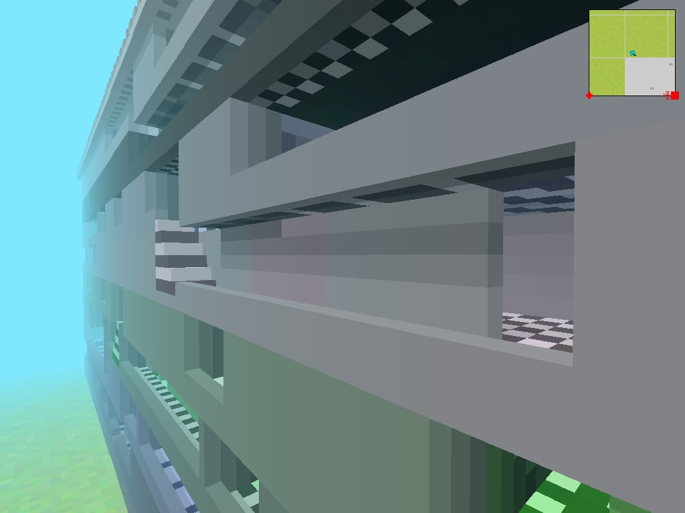

vxlgen
======

A labyrinth map generation tool for Ace of Spades "Classic" (0.75 and 0.76).

[logo]: https://github.com/adam-p/markdown-here/raw/master/src/common/images/icon48.png "Logo Title Text 2"

Updates and pictures are posted in this thread: http://buildandshoot.com/viewtopic.php?f=35&t=5239

The generated map work with the server mod "laby.py" which is still buggy.

Also it needs a map generation hook to be generated on the fly.

Usage
=====
usage: vxlgen [-seed n] [-o output-file.vxl]

License
=======

See LICENSE.

Algorithm
=========

Nothing much interesting. It works on 4x4x6 "cells".

To ensure there is a path from anywhere to anywhere the algorithm works as follow:
* place walls and floor randomly
* place rooms (approximately 10% of the tower volume)
* place stairs randomly (approximately 8 for a 128x128 floor)
* for each floor
  - colour each connected group of cells
  - create connections until there is only one colour
* bury unreachable areas
* bury dead-ends

Screenshots
===========

- Corridors

- Roof

- Spawn point is inside the building to avoid spawn camping

- Trees and sea

- Rooms

- Up to 10 floors

